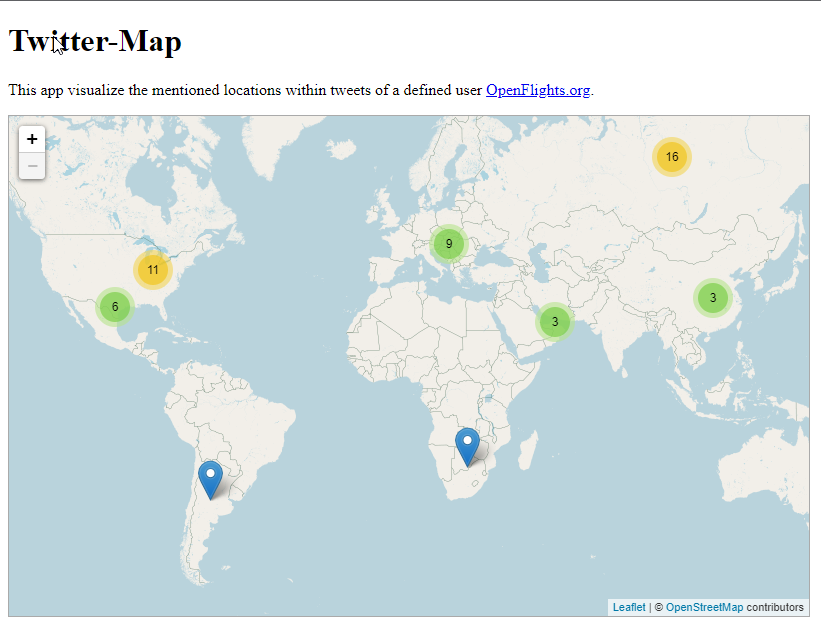
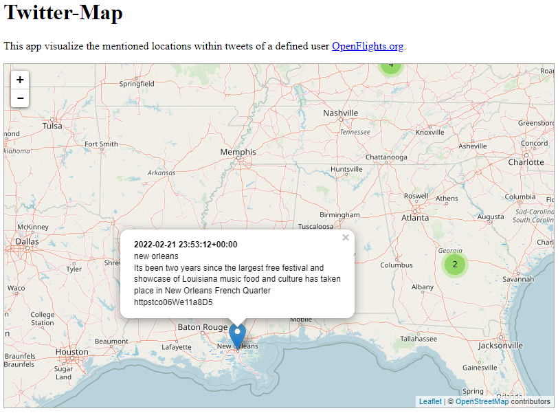

# Twitter-Map
This project shows the location of tweets from specific users on a map.

**Example**

Example for Tweets of @ABC (News Channel)

<ins>Overview</ins>


<ins>Detail</ins>


## Required Software and Tools
* [Python 3.7](https://www.python.org/downloads/)
* [Pipenv](https://docs.pipenv.org/en/latest/)

## Clone the project with either SSH or HTTPS and change directory

```
git clone git@github.com:malik-majeed/flask-template.git
```
or
```
git clone https://github.com/malik-majeed/flask-template.git
```

Change the current working directory

```
cd flask-template
```

## Install all dependencies

```
pipenv install
```
**Note: If you have multiple Python versions or variations of Python2 and Python3 (set as PATH variables) you need to specify Python3 for your virtual environment!**

```
pipenv install --three
```
## Start up the virtual environment for development

```
pipenv shell
```

## Install the dependencies

```
pip install -r requirements.txt
```

## Set your Bearer Token in views.py

```
client = tweepy.Client("<YOUR_BEARER_TOKEN>")
```

# Start the project locally

```

flask run
```
**The project is now up and running at 'localhost:5000'**
